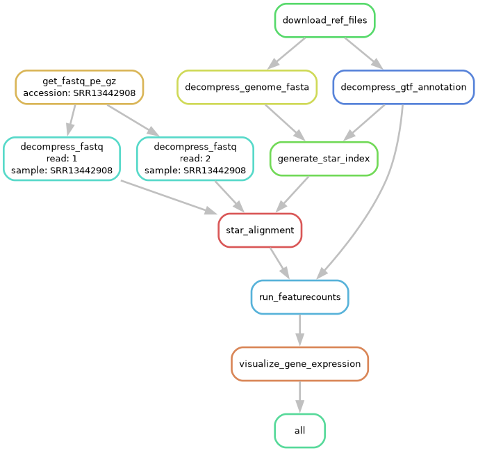
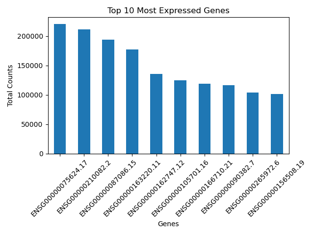

# RNA-seq Data Processing Workflow

This repository contains an RNA-seq data processing workflow using Snakemake. The workflow includes steps for downloading data, running quality control, aligning reads to a reference genome, counting features, and visualizing gene expression. This pipeline has been recreated in part [RNA Sequencing of Whole Blood Defines the Signature of High Intensity Exercise at Altitude in Elite Speed Skaters](https://www.mdpi.com/2073-4425/13/4/574). The data can be found [here](https://www.ncbi.nlm.nih.gov/geo/query/acc.cgi?acc=GSE164890)

## Repository Structure

The structure of the repository is as follows:

```sh
├── FastQC
├── config
│   └── config.yaml
├── data
├── images
│   └── dag.png
├── logs
├── slurm
│   └── config.yaml
├── sra_ids.txt
└── workflow
    ├── Snakefile
    ├── rules
    └── scripts
```


## Pipeline steps

As a quick note the pipeline takes a accesion number as input, on the current config file only two accession number are given. This is for process length purposes. In the repo you can find a file sra_ids.txt, this is a txt file with all the relevant accesion numbers that have been used in the original research.

1. Fetches paired-end FASTQ files using accession numbers from the SRA (Sequence Read Archive).
2. Runs FastQC on the downloaded FASTQ files to assess the quality of the sequencing data.
3. Downloads the reference genome and annotation files.
4. Decompresses the reference genome FASTA file.
5. Decompresses the GTF annotation file.
6. Decompresses the downloaded FASTQ files.
7. Generates the STAR index using the reference genome and GTF annotation.
8. Aligns the paired-end reads to the reference genome using STAR.
9. Runs featureCounts to evaluate gene expression by counting the number of reads aligned to each gene.
10. Visualizes gene expression data by creating a bar plot of gene expression counts.

### Packages
- `python`
- `matplotlib`
- `seaborn`
- `pandas`
- `numpy`
- `sra-tools`
- `fastqc`
- `star`
- `subread`

## Setting Up the Workspace

1. **Create a conda virtual environment:**

    ```sh
    conda create -n snakemake_env
    ```

2. **Activate the conda virtual environment:**
   
    ```sh
    conda activate snakemake_env
    ``` 

3. **Install Snakemake:**

    ```sh
    conda install -c bioconda snakemake
    ```
4. **Install Snakemake wrapper utils:**

    ```sh
    pip install snakemake_wrapper_utils
    ```
5. **Install sra-tools:**

    ```sh
    conda install -c bioconda sra-tools
    ```

3. **Configure the `config.yaml` file:**

    Edit the `config/config.yaml` file to set the appropriate datapaths and parameters for your specific dataset and reference genome.
    Add extra accession numbers for a more expanded run

## Running the Workflow
To execute the workflow, run the following command:

```sh
snakemake --snakefile workflow/Snakefile --cores <number_of_cores>
```
## Graphical view of the pipeline


## Example output
Because of how timeconsuming this pipeline can be it is currently set up to use one sample.

```sh
accession: 
  - SRR13442908
```



## Troubleshooting

In case of any erros please contact:
- Sibren Reekers
- [email](sibrenreekers@gmail.com)
- [github](https://github.com/SibrenReekers)


